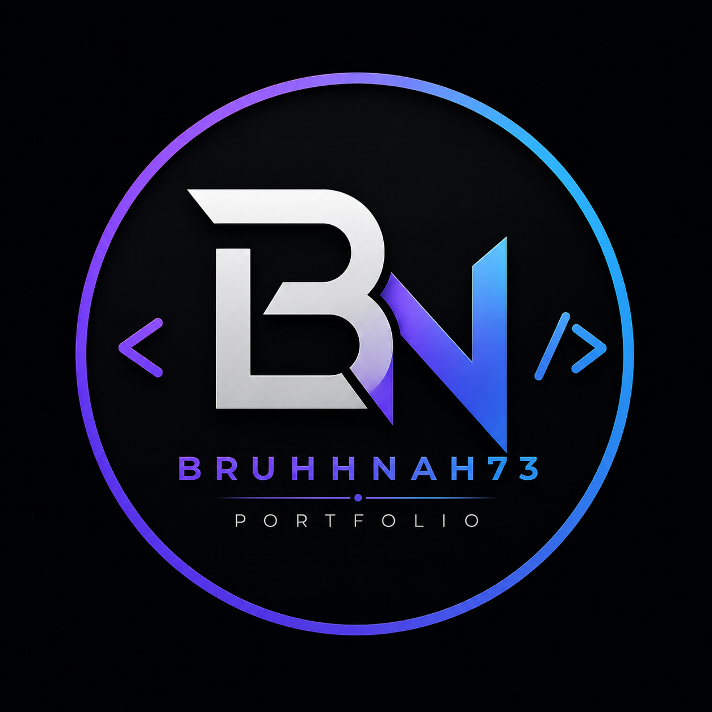

# ⚡ BRUHH.DEV — Developer Portfolio

<p align="center">
  
</p>

<h3 align="center">
  I Build. I Experiment. I Create. ⚡
</h3>

<p align="center">
  Student • AI Builder • Web Developer • Tech Explorer
</p>

<p align="center">
  <a href="https://bruhhnah73-collab.github.io/my-portfolio/">
    🌐 Live Portfolio
  </a>
</p>

---

# 🧑‍💻 About This Portfolio

**BRUHH.DEV** is my personal developer portfolio website.

This website is a place where I showcase the projects, websites, AI systems, automation workflows, electronics projects, experiments, and other things I've built while learning technology.

Instead of being just a traditional portfolio, I wanted this website to feel like a small developer environment.

It includes:

- ⚡ Animated startup screen
- 🖥️ Developer-style interface
- 🌐 Project showcase
- 🤖 Portfolio AI Assistant
- 📬 AI Email Assistant
- ⌨️ Developer Terminal
- 🌙 Dark / ☀️ Light mode
- ✨ Animated background
- 📊 Project statistics
- 🔎 Project navigation
- 📱 Responsive design
- 🚀 GitHub Pages deployment

The portfolio is continuously being updated as I build new projects.

---

# 🌐 Live Website

## 🚀 Visit the Portfolio

**https://bruhhnah73-collab.github.io/my-portfolio/**

The live website is hosted using **GitHub Pages**.

---

# 🎯 Portfolio Purpose

The main goal of this website is to document and showcase what I'm learning and building.

My projects cover several different areas:

```text
AI
│
├── AI Chatbots
├── AI Assistants
├── AI Email Automation
└── AI APIs

Web Development
│
├── Websites
├── Dashboards
├── Interactive Interfaces
└── Developer Tools

Automation
│
├── Cloud Workflows
├── Data Pipelines
└── AI Automation

Electronics
│
├── Arduino
├── Sensors
├── Circuit Design
└── Browser Circuit Simulation
